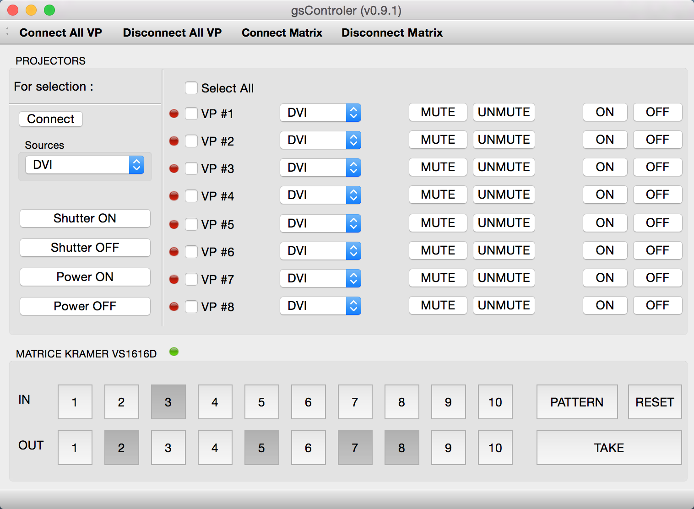

QPJControler
============

Video projector controller UI + Kramer DVI Matrix using Qt Framework.

gsControler is designed using Qt Creator 2.8.1 based on Qt 5.1.1 under MacOSX 10.10

Only works for PJLINK protocol projectors without login/password

License
-------

gsController - Graphical user interface for controling audiovisual devices
Martial GALLORINI (http://martialgallorini.github.io/)

This program is free software: you can redistribute it and/or modify
it under the terms of the GNU General Public License as published by
the Free Software Foundation, either version 3 of the License, or
(at your option) any later version.

This program is distributed in the hope that it will be useful,
but WITHOUT ANY WARRANTY; without even the implied warranty of
MERCHANTABILITY or FITNESS FOR A PARTICULAR PURPOSE. See the
GNU General Public License for more details.

You should have received a copy of the GNU General Public License
along with this program.  If not, see <http://www.gnu.org/licenses/>.